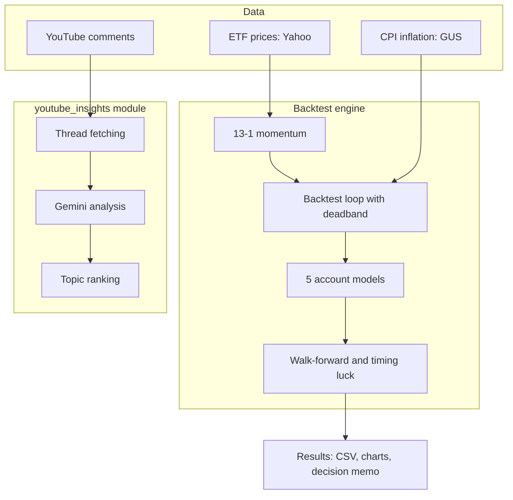

<p align="center"></p>

<h1 align="center">GEM on IKE</h1>

<h3 align="center">Which Polish IKE account wins with monthly ETF rotation? A backtest of the momentum strategy with real costs across five account types.</h3>

<p align="center">
  
  
  
  
  
</p>

---

## Table of Contents

- [About](#about)
- [Charts](#charts)
- [Source Code](#source-code)
- [Tech Stack](#tech-stack)
- [Features](#features)
- [Architecture](#architecture)
- [Statistics](#statistics)
- [My Role](#my-role)
- [Contact](#contact)

---

## About

A Polish investor with an IKE (tax-exempt retirement account) usually hears one thing: buy an ETF every month and hold. The momentum strategy says something else: every month, move all capital into the strongest ETF. In Poland, every such rotation costs money: commission, FX conversion, no fractional shares, and outside IKE the capital gains tax. Which account keeps the most of this strategy? Nobody had computed this with the real costs of Polish brokers.

This project does. Thirteen years of prices, month by month, across five account models: XTB, BOSSA (promo and standard), mBank eMakler, and a taxed account. The strategy rotates only when the strongest ETF's edge crosses a threshold (deadband), and the threshold is fitted on training data and validated on later periods. Monthly contributions are indexed to inflation from GUS (Statistics Poland). The output is a concrete decision: account, threshold, ETF basket.

The backtest recommendation: BOSSA IKE on the promo terms, a 5.4% threshold, a five-ETF basket. The result: 17.67% annually (XIRR) against the 12.27% buy-and-hold benchmark, with a similar maximum drawdown. The taxed account: 14.84%, the tax eats the edge. This is educational research, not investment advice.

The deadband strategy logic was invented and [described on X](https://x.com/HVNF_Negro/status/2027551899675758826) by Adrian, the project's co-author. A major investment YouTuber (200k subscribers), Zawod Inwestor, [covers this analysis in his video](https://youtu.be/N1G4agLw-GM?t=1093) (from 18:13) as work that genuinely helped him.

---

## Charts

| Five accounts, same strategy: BOSSA IKE on top, taxed account at the bottom | 41 rotation threshold variants: return, risk, and trade count |
|:---:|:---:|
|  |  |

| Three ETF baskets: five instruments beat wider ones | Same signal, five different days of the month |
|:---:|:---:|
|  |  |

> **Note:** charts come from a local backtest run. Market data from Yahoo, inflation from GUS, capital and contributions hypothetical. This is not a real portfolio.

---

## Source Code

The code is open source: [gem-zi-checkup](https://github.com/kamilkaczmareksolutions/gem-zi-checkup). This repository is the showcase: summary, results, and charts.

---

## Tech Stack

### Backtest Engine

```
Python 3                   // 17 files, 93 functions
pandas + numpy             // monthly series, 13-1 momentum
yfinance                   // LSE ETF prices, 2012-2026
scipy                      // XIRR (brentq)
GUS BDL API                // annual CPI for contribution indexing
PyYAML                     // account and basket specs
matplotlib                 // result charts
```

### LLM Module

```
YouTube Data API v3        // comment threads from a playlist
Gemini                     // topic extraction, aggregation, ranking
JSON checkpoints           // incremental thread analysis
```

---

## Features

### Backtest

- **Five account models** - XTB, BOSSA (promo and standard), mBank eMakler, taxed account. Each with real costs: commission, FX conversion, no fractional shares, capital gains tax
- **Momentum with a brake** - rotation only when the strongest ETF's edge crosses a threshold. The 5.4% threshold lifts the BOSSA result from 15.68% to 17.67% and cuts rotations from 30 to 11
- **Out-of-sample validation** - the threshold fitted on training data, verified on later periods. Four walk-forward windows, average OOS result 13.17% annually
- **Timing luck** - the same signal fired on the 5th, 10th, or 20th day of the month spreads results by 1.87 pp. The outcome does not hang on one lucky day
- **Inflation-indexed contributions** - the monthly contribution grows with the CPI index from GUS. A simulation closer to real saving
- **Scenarios and breakeven** - contributions of 500, 1,000, and 2,000 PLN monthly, plus the line where free promos beat zero-commission competitors

### LLM Module (youtube_insights)

- **Topic ranking from comments** - YouTube playlist comments go to a language model that ranks topics for educational content. Weights: frequency, severity, actionability, buyer intent
- **Incremental analysis** - an unchanged thread is never computed twice. API cost grows only with new comments

---

## Architecture



---

## Statistics

### Backtest Results (5.4% deadband, 1,000 PLN/month CPI-indexed, 157 months)

| Account | XIRR | Edge over benchmark |
|---|---|---|
| **BOSSA IKE (promo)** | 17.67% | +5.40 pp |
| **mBank IKE (eMakler)** | 17.45% | +5.18 pp |
| **XTB IKE** | 16.79% | +4.51 pp |
| **Taxed account** | 14.84% | +2.57 pp |
| **Benchmark: IWDA buy and hold** | 12.27% | - |

### Technical Complexity

| Metric | Count |
|---|---|
| **Commits** | 36 (February-March 2026) |
| **Authors** | 2 |
| **Lines of Python** | 3,453 |
| **Account models** | 5 |
| **Deadband variants** | 41 (0-8% in 0.2 pp steps) |
| **Walk-forward windows** | 4 (60-month train, 24-month test) |
| **ETF baskets** | 3 (5, 7, and 9 instruments) |
| **Result files** | 28 (21 CSVs, 6 charts, decision memo) |

### Features Overview

| Category | Highlights |
|---|---|
| **Backtest** | 5 accounts, deadband, walk-forward, timing luck |
| **Data** | Yahoo, CPI from GUS, indexed contributions |
| **Decision** | account + threshold + basket, contribution scenarios |
| **LLM** | topic ranking from YouTube comments |

---

## My Role

The deadband strategy logic was invented by [Adrian](https://github.com/Bipopski) - his analysis is the one Zawod Inwestor covers in the video mentioned above. I coded it: the backtest engine, account models, metrics (XIRR), GUS inflation indexing, the runner, and the youtube_insights module. Adrian then worked on branches, tuning parameters and out-of-sample validations. Commit split: 13 Kamil, 23 Adrian.

---

## Contact

| Platform | Link |
|---|---|
| **WWW** | [kamilkaczmareksolutions.com](https://kamilkaczmareksolutions.com) |
| **GitHub** | [kamilkaczmareksolutions](https://github.com/kamilkaczmareksolutions) |
| **LinkedIn** | [Kamil Kaczmarek](https://www.linkedin.com/in/kamilkaczmareksolutions) |
| **Email** | [recruitment@kamilkaczmareksolutions.com](mailto:recruitment@kamilkaczmareksolutions.com) |

---

**GEM on IKE** - same strategy, five accounts, one verdict.

<p align="center"><em>Built by Kamil Kaczmarek and <a href="https://github.com/Bipopski">Adrian</a></em></p>
