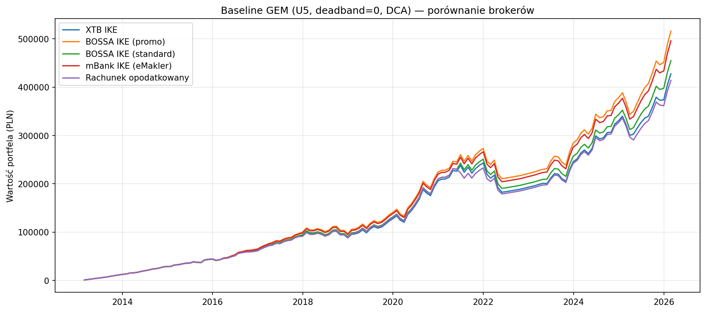
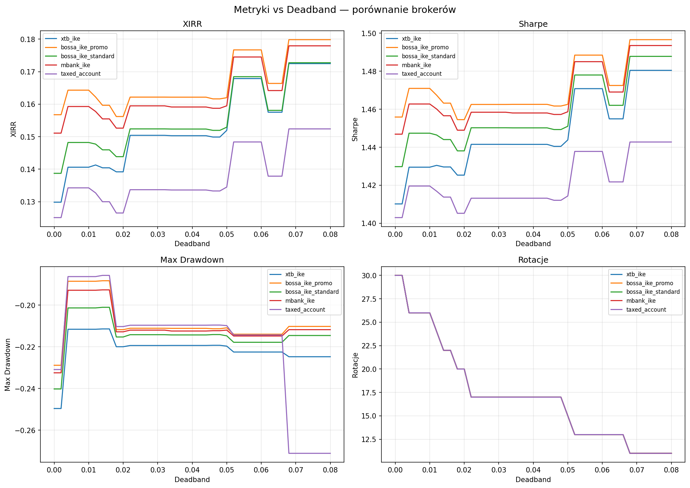
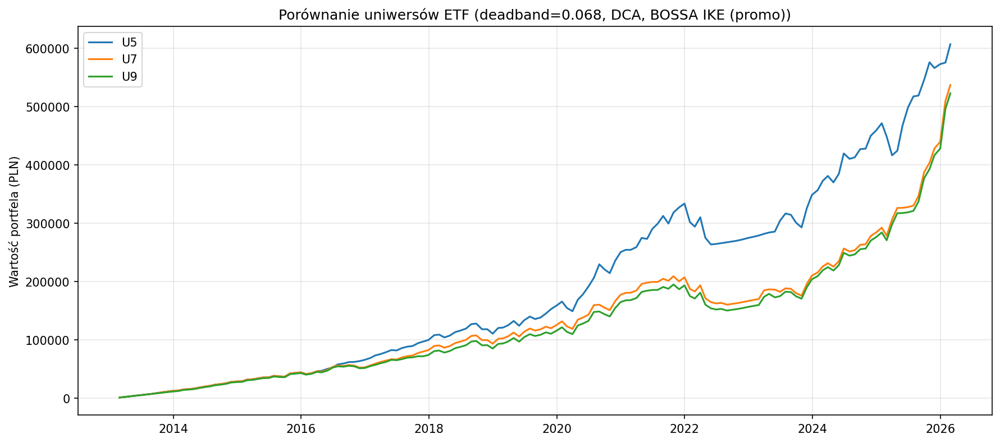
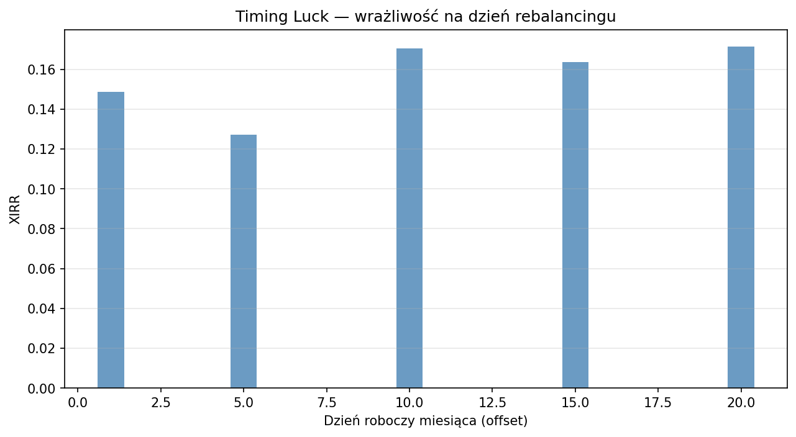
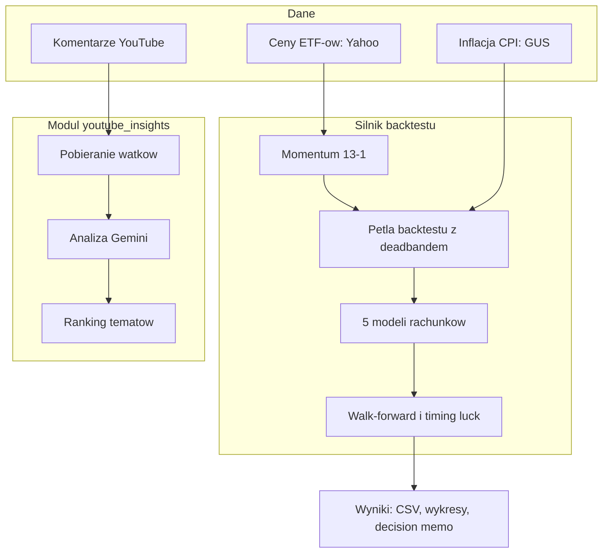

<p align="center"></p>

<h1 align="center">GEM na IKE</h1>

<h3 align="center">Które polskie IKE wygrywa przy comiesięcznej rotacji ETF-ów? Backtest strategii momentum z realnymi kosztami pięciu rachunków.</h3>

<p align="center">
  
  
  
  
  
</p>

---

## Spis treści

- [O projekcie](#o-projekcie)
- [Wykresy](#wykresy)
- [Kod źródłowy](#kod-źródłowy)
- [Stack](#stack)
- [Funkcje](#funkcje)
- [Architektura](#architektura)
- [Statystyki](#statystyki)
- [Moja rola](#moja-rola)
- [Kontakt](#kontakt)

---

## O projekcie

Polski inwestor na IKE słyszy zwykle jedno: kupuj co miesiąc ETF i trzymaj. Strategia momentum mówi co innego: co miesiąc przenoś całość kapitału do najsilniejszego ETF-u. W Polsce każda taka rotacja kosztuje: prowizja, przewalutowanie, brak akcji ułamkowych, a poza IKE podatek Belki. Które konto zostawia inwestorowi najwięcej z tej strategii? Tego nikt nie liczył z realnymi kosztami polskich brokerów.

Ten projekt liczy. Trzynaście lat notowań, miesiąc po miesiącu, dla pięciu modeli rachunków: XTB, BOSSA w promocji i w standardzie, mBank eMakler i rachunek opodatkowany. Strategia rotuje tylko wtedy, gdy przewaga najlepszego ETF-u przekracza próg (deadband), a próg jest dobrany na danych treningowych i sprawdzony na późniejszych. Wpłaty miesięczne waloryzuje inflacją z GUS. Na końcu stoi konkretna decyzja: rachunek, próg, koszyk.

Rekomendacja z backtestu: BOSSA IKE w promocji, próg 5.4%, koszyk pięciu ETF-ów. Wynik 17.67% rocznie (XIRR) przy 12.27% benchmarku kup-i-trzymaj, przy podobnym maksymalnym obsunięciu. Rachunek opodatkowany: 14.84%, podatek zjada przewagę. To badanie edukacyjne, nie rekomendacja inwestycyjna.

Logikę strategii z deadbandem wymyślił i [opisał na X](https://x.com/HVNF_Negro/status/2027551899675758826) Adrian, współautor projektu. Duży youtuber inwestycyjny (200 tys. subskrypcji), Zawód Inwestor, [omawia tę analizę w swoim filmie](https://youtu.be/N1G4agLw-GM?t=1093) (od 18:13) jako pracę, która realnie mu pomogła.

---

## Wykresy

| Pięć rachunków, ta sama strategia: BOSSA IKE na górze, rachunek opodatkowany na dole | 41 wariantów progu rotacji: wynik, ryzyko i liczba transakcji |
|:---:|:---:|
|  |  |

| Trzy koszyki ETF: pięć instrumentów wygrywa z szerszymi | Ten sam sygnał, pięć różnych dni miesiąca |
|:---:|:---:|
|  |  |

> **Nota:** wykresy pochodzą z lokalnego uruchomienia backtestu. Dane rynkowe z Yahoo, inflacja z GUS, kapitał i wpłaty hipotetyczne. To nie jest realny portfel.

---

## Kod źródłowy

Kod jest otwarty: [gem-zi-checkup](https://github.com/kamilkaczmareksolutions/gem-zi-checkup). To repo to wizytówka: streszczenie, wyniki i wykresy.

---

## Stack

### Silnik backtestu

```
Python 3                   // 17 plików, 93 funkcje
pandas + numpy             // szeregi miesięczne, momentum 13-1
yfinance                   // ceny ETF-ów LSE, 2012-2026
scipy                      // XIRR (brentq)
GUS BDL API                // roczne CPI do waloryzacji wpłat
PyYAML                     // specyfikacja rachunków i koszyków
matplotlib                 // wykresy wyników
```

### Moduł LLM

```
YouTube Data API v3        // wątki komentarzy z playlisty
Gemini                     // ekstrakcja tematów, agregacja, ranking
checkpointy JSON           // analiza przyrostowa wątków
```

---

## Funkcje

### Backtest

- **Pięć modeli rachunków** - XTB, BOSSA (promocja i standard), mBank eMakler, rachunek opodatkowany. Każdy z realnymi kosztami: prowizja, przewalutowanie, brak akcji ułamkowych, podatek Belki
- **Momentum z hamulcem** - rotacja tylko gdy przewaga najlepszego ETF-u przekracza próg. Próg 5.4% podnosi wynik BOSSA z 15.68% do 17.67% i tnie liczbę rotacji z 30 do 11
- **Walidacja poza próbą** - próg dobrany na danych treningowych, sprawdzony na późniejszych. Cztery okna walk-forward, średni wynik OOS 13.17% rocznie
- **Timing luck** - ten sam sygnał odpalony 5., 10. albo 20. dnia miesiąca daje rozrzut 1.87 pp. Wynik nie wisi na jednym szczęśliwym dniu
- **Wpłaty waloryzowane inflacją** - miesięczna wpłata rośnie ze wskaźnikiem CPI z GUS. Symulacja bliższa realnego oszczędzania
- **Scenariusze i próg opłacalności** - wpłaty 500, 1000 i 2000 zł miesięcznie oraz granica, od której darmowe promocje biją zero prowizji u konkurencji

### Moduł LLM (youtube_insights)

- **Ranking tematów z komentarzy** - komentarze z playlisty YouTube trafiają do modelu językowego, który układa ranking tematów pod materiały edukacyjne. Wagi: częstotliwość, dotkliwość, wykonalność, intencja zakupu
- **Analiza przyrostowa** - niezmieniony wątek nie jest liczony drugi raz. Koszt API rośnie tylko o nowe komentarze

---

## Architektura



---

## Statystyki

### Wyniki backtestu (deadband 5.4%, wpłata 1000 zł/mies. waloryzowana CPI, 157 miesięcy)

| Rachunek | XIRR | Przewaga nad benchmarkiem |
|---|---|---|
| **BOSSA IKE (promocja)** | 17.67% | +5.40 pp |
| **mBank IKE (eMakler)** | 17.45% | +5.18 pp |
| **XTB IKE** | 16.79% | +4.51 pp |
| **Rachunek opodatkowany** | 14.84% | +2.57 pp |
| **Benchmark: IWDA kup i trzymaj** | 12.27% | - |

### Złożoność techniczna

| Metryka | Wartość |
|---|---|
| **Commity** | 36 (luty-marzec 2026) |
| **Autorzy** | 2 |
| **Linie Pythona** | 3 453 |
| **Modele rachunków** | 5 |
| **Warianty deadbandu** | 41 (0-8% co 0.2 pp) |
| **Okna walk-forward** | 4 (trening 60 mies., test 24) |
| **Koszyki ETF** | 3 (5, 7 i 9 instrumentów) |
| **Pliki wynikowe** | 28 (21 CSV, 6 wykresów, decision memo) |

### Przegląd funkcji

| Kategoria | Najważniejsze |
|---|---|
| **Backtest** | 5 rachunków, deadband, walk-forward, timing luck |
| **Dane** | Yahoo, CPI z GUS, waloryzacja wpłat |
| **Decyzja** | rachunek + próg + koszyk, scenariusze wpłat |
| **LLM** | ranking tematów z komentarzy YouTube |

---

## Moja rola

Logikę strategii z deadbandem wymyślił [Adrian](https://github.com/Bipopski) - to jego analizę Zawód Inwestor omawia we wspomnianym filmie. Zakodowałem ją ja: silnik backtestu, modele rachunków, metryki (XIRR), waloryzacja inflacją z GUS, runner i moduł youtube_insights. Potem Adrian pracował na branchach i dostrajał parametry oraz walidacje out-of-sample. Podział commitów: 13 Kamil, 23 Adrian.

---

## Kontakt

| Platforma | Link |
|---|---|
| **WWW** | [kamilkaczmareksolutions.com](https://kamilkaczmareksolutions.com) |
| **GitHub** | [kamilkaczmareksolutions](https://github.com/kamilkaczmareksolutions) |
| **LinkedIn** | [Kamil Kaczmarek](https://www.linkedin.com/in/kamilkaczmareksolutions) |
| **Email** | [recruitment@kamilkaczmareksolutions.com](mailto:recruitment@kamilkaczmareksolutions.com) |

---

**GEM na IKE** - ta sama strategia, pięć rachunków, jeden werdykt.

<p align="center"><em>Zbudowali Kamil Kaczmarek i <a href="https://github.com/Bipopski">Adrian</a></em></p>
